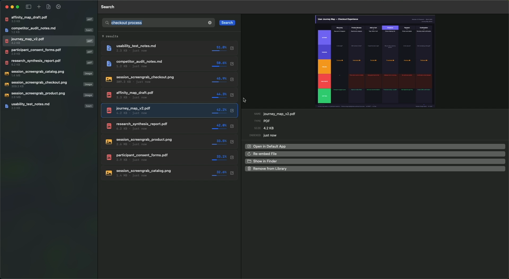

# Vektra

Semantic search across all your files — video, audio, images, PDFs, and text — powered by Google Gemini Embeddings. Local-first, native macOS SwiftUI app, BYOK (Bring Your Own Key).



---

## Setup in Xcode

**Quick start:** Clone this repo and open **`Vektra.xcodeproj`** in Xcode, then press **⌘R** to build and run. Add your Google API key in **Settings (⌘,)** before embedding.

### Build from Terminal (no Xcode UI)

From this folder:

```bash
make build
```

Or directly:

```bash
xcodebuild -project "Vektra.xcodeproj" -target "Vektra" -configuration Debug -destination 'platform=macOS' build
```

**Or set up from scratch:**

### 1. Create the Xcode project

1. Open Xcode → **File → New → Project**
2. Choose **macOS → App**
3. Set:
   - Product Name: `Vektra`
   - Bundle Identifier: `io.vektra.app` (or any reverse-domain you own)
   - Interface: **SwiftUI**
   - Language: **Swift**
   - Uncheck "Include Tests" (optional)

### 2. Add the source files

Delete the auto-generated `ContentView.swift` and `VektraApp.swift` that Xcode creates, then add all `.swift` files from this folder into the project (drag into the Project Navigator, ensure "Copy items if needed" is checked).

Files to add:
- `VektraApp.swift`
- `Models.swift`
- `DatabaseService.swift`
- `EmbeddingService.swift`
- `AppStore.swift`
- `ContentView.swift`
- `LibrarySidebar.swift`
- `SearchView.swift`
- `PreviewPanel.swift`
- `SettingsView.swift`
- `MediaDurationHelper.swift`

### 3. Configure entitlements

In the project settings → **Signing & Capabilities**, add:
- **App Sandbox** → enable **Outgoing Connections (Client)** (required for Google API)
- **App Sandbox** → enable **User Selected File → Read** (for file picker)

Or for simpler dev builds, you can temporarily disable App Sandbox entirely (not recommended for distribution).

In your `.entitlements` file, ensure:
```xml
<key>com.apple.security.network.client</key>
<true/>
<key>com.apple.security.files.user-selected.read-only</key>
<true/>
```

### 4. Set minimum deployment target

Project settings → General → Minimum Deployments → **macOS 13.0** or later (required for NavigationSplitView).

### 5. Run

Press **⌘R** to build and run.

---

## Building a distributable app

### For personal use / sharing without App Store:

1. **Product → Archive**
2. In the Organizer, click **Distribute App**
3. Choose **Direct Distribution**
4. Sign with your Apple Developer account (free account = can't notarize, paid = can notarize)

To avoid Gatekeeper blocking on other Macs:
- With a paid Apple Developer account: notarize the app via `xcrun notarytool`
- Without: recipients right-click → Open on first launch

### For App Store distribution:
Change the entitlements to full App Sandbox compliance and submit through App Store Connect.

---

## Features

- **Three-panel layout**: Library sidebar / Search + Results / Preview
- **Native media players**: AVKit for video and audio, PDFKit for PDF, native NSImage for images
- **Semantic search**: Natural language queries via Google Gemini Embeddings
- **Cost estimation**: Shows token count and USD estimate before any API call
- **BYOK**: Users bring their own Google API key — no backend, no subscription
- **Local storage**: Embeddings saved as JSON in `~/Library/Application Support/Vektra/`
- **Drag & drop**: Drop files onto the window to add them
- **Progress toasts**: Native bottom-right overlay for embed progress
- **QuickLook-compatible**: "Show in Finder" and "Open in Default App" buttons

---

## Supported File Types

| Type  | Extensions |
|-------|------------|
| Video | .mp4 .mov .avi .mkv .webm .m4v |
| Audio | .mp3 .wav .aac .flac .m4a .ogg |
| Image | .jpg .jpeg .png .gif .webp .heic |
| PDF   | .pdf |
| Text  | .txt .md .csv .json .html .xml |

**Embedding API limits (Gemini):** Only **JPEG and PNG** images can be embedded; GIF/WebP/HEIC will show an error. **PDFs are limited to 6 pages** per file; longer PDFs will be rejected with a clear message.

---

## Pricing (verify at ai.google.dev/pricing)

| File Type | Token Rate | Est. Cost |
|-----------|-----------|-----------|
| Video | 258 tokens/sec | ~$0.14/hr |
| Audio | 32 tokens/sec | ~$0.02/hr |
| Image | 258 tokens/file | ~$0.0001/file |
| PDF/Text | ~800 tokens/page | ~$0.0001/page |
| **Base rate** | | **$0.15 / 1M tokens** |

Video segment limits: **80s** when the file has an audio track, **120s** when it has no audio; the app detects this automatically.

---

## Architecture

```
VektraApp
├── AppStore (ObservableObject — all state)
├── EmbeddingService (actor — Google API)
├── DatabaseService (singleton — local JSON)
└── Views
    ├── ContentView (NavigationSplitView root)
    ├── LibrarySidebar
    ├── SearchView + ResultCard
    ├── PreviewPanel
    │   ├── VideoPreviewView (AVKit)
    │   ├── AudioPreviewView (AVKit)
    │   ├── ImagePreviewView (NSImage)
    │   ├── PDFPreviewView (PDFKit)
    │   └── TextPreviewView
    ├── SettingsView
    └── ConfirmEmbedView
```

---

## Credits
Yard
- **Repo**: `https://github.com/0xyard/vektra`
